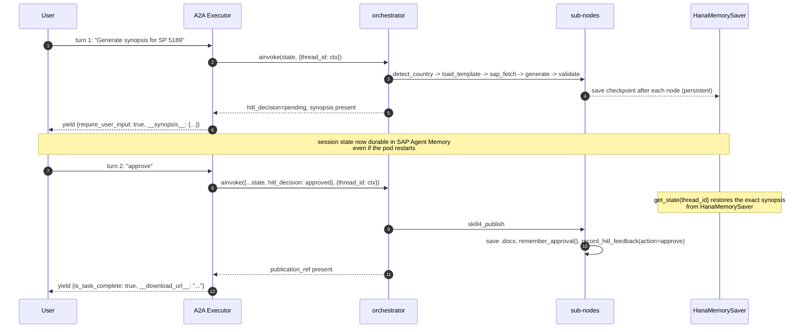

# Tender Synopsis Agent — LangGraph Workflow

> **Source of truth:** [`app/agent.py`](../app/agent.py) — the graph is built by `build_graph()`.
>
> **How this file is kept in sync:**
> The GitHub Action at
> [`.github/workflows/regenerate-graph-diagram.yml`](../.github/workflows/regenerate-graph-diagram.yml)
> runs `python -m app.tools.render_graph` on every push that touches
> `app/agent.py` and force-commits the regenerated Mermaid + PNG back to
> `main`. Do **NOT** hand-edit this file — your changes will be overwritten
> at the next push.
>
> **This is the initial hand-authored diagram** (matching the current graph
> definition). The first automated regeneration on push will produce a
> byte-identical version.

---

## Star topology (E7 orchestrator pattern)

All routing happens in one place — `orchestrator()` in `app/agent.py`.
Every sub-node returns control to it, so adding a new node is a single
`if / elif` in that function.

```mermaid
%%{init: {'flowchart': {'curve': 'basis'}}}%%
graph TD
    __start__([<b>START</b>]):::start
    orchestrator{{orchestrator<br/><i>pure-Python router</i>}}:::router

    detect_country[detect_country]:::skill
    load_template[load_template]:::skill
    sap_fetch[sap_fetch]:::skill
    generate_synopsis[generate_synopsis]:::skill
    ai_validate[ai_validate]:::skill
    await_hitl[/await_hitl<br/><i>HITL gate</i>/]:::hitl
    skill4_publish[skill4_publish]:::skill

    __end__([<b>END</b>]):::finish

    %% Entry
    __start__ --> orchestrator

    %% Fan-out: orchestrator dispatches to any sub-node
    orchestrator -->|next_skill=detect_country|    detect_country
    orchestrator -->|next_skill=load_template|     load_template
    orchestrator -->|next_skill=sap_fetch|         sap_fetch
    orchestrator -->|next_skill=generate_synopsis| generate_synopsis
    orchestrator -->|next_skill=ai_validate|       ai_validate
    orchestrator -->|next_skill=await_hitl|        await_hitl
    orchestrator -->|next_skill=skill4_publish|    skill4_publish
    orchestrator -->|next_skill=end|               __end__

    %% Fan-in: every sub-node returns to the orchestrator
    detect_country    --> orchestrator
    load_template     --> orchestrator
    sap_fetch         --> orchestrator
    generate_synopsis --> orchestrator
    ai_validate       --> orchestrator
    await_hitl        --> orchestrator
    skill4_publish    --> orchestrator

    classDef start   fill:#0070F2,stroke:#003D75,color:white,font-weight:bold;
    classDef finish  fill:#107E3E,stroke:#0B5C2C,color:white,font-weight:bold;
    classDef router  fill:#1B2A4A,stroke:#0F1B33,color:white,font-weight:bold;
    classDef skill   fill:#FFFFFF,stroke:#0070F2,color:#1B2A4A;
    classDef hitl    fill:#E9730C,stroke:#B85908,color:white,font-weight:bold;
```

---

## Node responsibilities

| Node | File | What it does | Enhancement |
|---|---|---|---|
| `orchestrator` | `agent.py::orchestrator()` | Pure-Python if/else router. Zero LLM calls. Decides `next_skill` based on state completeness and HITL decision. | **E7** |
| `detect_country` | `agent.py::node_detect_country` | 4-level cascade from SAP `CompanyCodeCountry` → keyword scan → currency → DEFAULT. | E1 |
| `load_template` | `agent.py::node_load_template` | Calls `template_loader.load_template()` — Layer 1 (live) → Layer 2 (cache) → Layer 3 (file) → Layer 4 (default). | **E1** |
| `sap_fetch` | `agent.py::node_sap_fetch` | Fetches the 26-field Sourcing Project via OData V4. Idempotent — reuses if already loaded. | (existing) |
| `generate_synopsis` | `agent.py::node_generate_synopsis` | Loads prompt via registry, injects `PortalTemplate` + few-shot memories, calls Claude, applies response cache. | **E4 / E6 / E8** |
| `ai_validate` | `agent.py::node_ai_validate` | Calls validator prompt, applies weights + per-portal overrides, checks critical gates. Sets `verdict` = pass / amber / regenerate. | **E5** |
| `await_hitl` | `agent.py::node_await_hitl` | Marker node — LangGraph interrupt happens here. Turn 2+ is handled by orchestrator seeing `hitl_decision`. | (existing) |
| `skill4_publish` | `agent.py::node_skill4_publish` | Saves the approved `.docx`, records approval in Agent Memory, logs HITL feedback. | E8 |

---

## Routing rules (orchestrator decision table)

The orchestrator inspects state and picks the next node. This is the entire routing logic:

```python
if state.error:                                             -> end
elif hitl_decision == "approved":                           -> skill4_publish
elif hitl_decision == "rejected":                           -> end
elif hitl_decision == "edit":                               -> await_hitl (after applying edits)
elif not country_code:                                      -> detect_country
elif not portal_template:                                   -> load_template
elif not tender_data:                                       -> sap_fetch
elif not synopsis:                                          -> generate_synopsis
elif not validation:                                        -> ai_validate
elif validation.should_regenerate and attempts < MAX:       -> generate_synopsis (retry)
else:                                                       -> await_hitl
```

---

## Multi-turn (HITL) sequence



---

## How the diagram stays in sync

1. Developer edits `app/agent.py` (adds a node, changes routing, etc.).
2. On push to `main`, [`regenerate-graph-diagram.yml`](../.github/workflows/regenerate-graph-diagram.yml) fires.
3. It runs `python -m app.tools.render_graph`, which imports `build_graph()` and calls `graph.get_graph().draw_mermaid()` + `draw_mermaid_png()`.
4. The action auto-commits the fresh `docs/workflow.md` and `docs/langgraph_diagram.png` back to `main` with a `docs:` prefix.

Result: `docs/workflow.md` is always a byte-perfect snapshot of the runtime graph.